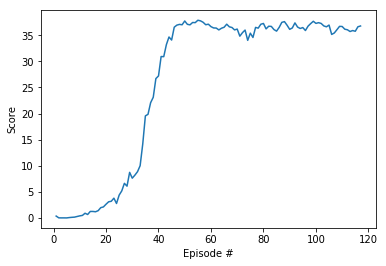

# Report

## Summary

This project implement a Deep Deterministic Policy Gradients (DDPG) as described in this [paper](https://arxiv.org/pdf/1509.02971.pdf). 
DDPG agent will atempt to solve Unity Reacher Environment 
The Goal of the agent is to keep double jointed mechanical hands inside target locations 

## Environment Info

- `Number of agents: 20` 
- `Number of actions: 4` 
- `State Length : 33 (Every Agent)`  

## Benchmark 

The problem is considered solved when the agents achieve average reward of 30+ over 100 consecutive episodes

## Parameter Values

- BUFFER_SIZE: 100000
- MAX_TIMESTEPS_EACH_EPISODE: 1000
- LEARNING_RATE: 1e-4 Both Networks
- GAMMA: 0.99
- WEIGHT_DECAY: 0
- TAU: 1e-3
- BATCH_SIZE: 128

## Network Info

### Actor
- Linear Layer:
    - Input Size: Observation Space = 33
    - Output Size: 256
    - Activation: [Rectifier](https://en.wikipedia.org/wiki/Rectifier_(neural_networks))

- Linear Layer:
    - Input Size: 256
    - Output Size: 128
    - Activation: [Rectifier](https://en.wikipedia.org/wiki/Rectifier_(neural_networks))

- Linear Layer:
    - Input Size: 128
    - Output Size: Action Space = 4
    - Activation: [Hyperbolic tangent](https://en.wikipedia.org/wiki/Hyperbolic_function#Hyperbolic_tangent)

### Critic
 - Linear Layer:
    - Input Size: Observation Space = 33
    - Output Size: 256
    - Activation: [Rectifier](https://en.wikipedia.org/wiki/Rectifier_(neural_networks))

- Linear Layer:
    - Input Size: 256 + (Action Space = 4)
    - Output Size: 128
    - Activation: [Rectifier](https://en.wikipedia.org/wiki/Rectifier_(neural_networks))

- Linear Layer:
    - Input Size: 128
    - Output Size: 1
    - Activation: [Rectifier](https://en.wikipedia.org/wiki/Rectifier_(neural_networks))

## Scores
`Environment solved in 116 episodes!	Average Score: 30.34`

## Future Plans

- Tryout different initial weights to measure impact on training time

## Remarks

DDPG Agent seems to have fastest convergence speed of all other policy based methods, although I found in my training that model is sometimes unstable and fails to converge.  Initial weights of model seem to impact a lot. When I tried to modify the weight initialization methods convergence time changed by +- 15 %  

